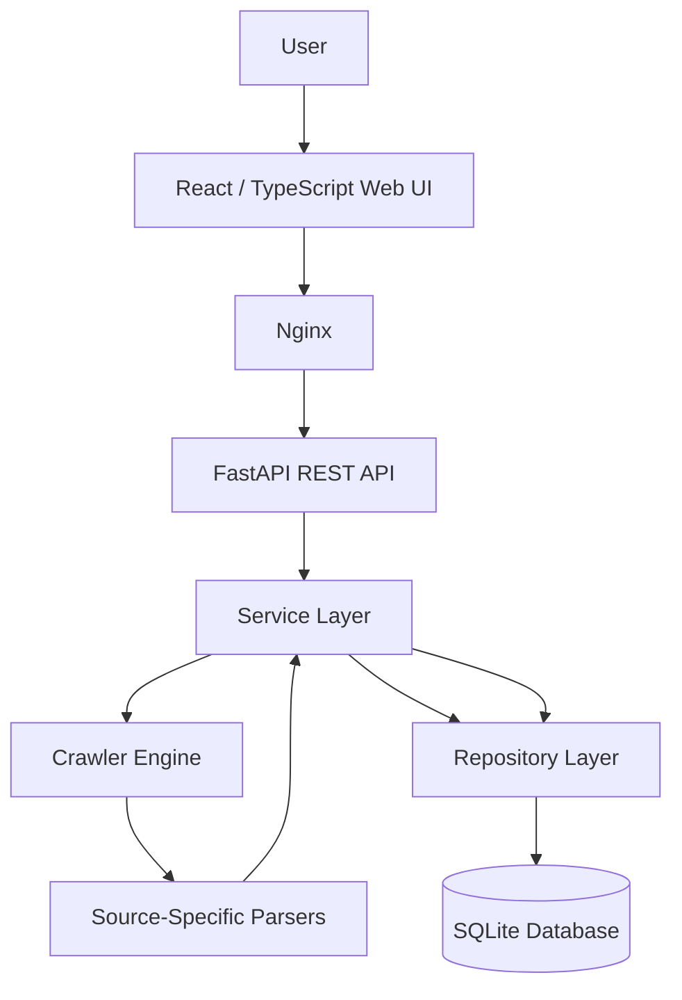
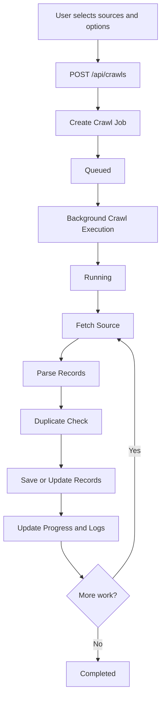
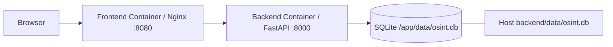

# Architecture Documentation

## 1. Overview

The OSINT Web Crawler Platform is designed as a modular full-stack application with clear separation between the user interface, REST API, crawler logic, data-access layer, and database.

The main architectural goal is to ensure that the frontend never communicates directly with the crawler engine or database. All operations are performed through the FastAPI REST API.

## 2. High-Level Architecture



Simplified flow:

```text
User
  ↓
React Web UI
  ↓
Nginx
  ↓
FastAPI REST API
  ↓
Service Layer
  ↓
Crawler Engine / Repository
  ↓
SQLite Database
```

## 3. Frontend Layer

The frontend is implemented with React and TypeScript.

Its responsibilities include:

- Displaying dashboard statistics
- Managing approved sources
- Starting new crawl jobs
- Monitoring crawl progress
- Displaying collected advisories
- Filtering and sorting advisory records
- Exporting advisory data
- Displaying crawl logs
- Showing advisory details

The frontend communicates only with the REST API.

In the Docker setup, Nginx serves the frontend and forwards `/api` requests to the backend service.

## 4. REST API Layer

FastAPI provides the application API.

Main route groups include:

- Health
- Sources
- Crawls
- Advisories
- Logs
- Statistics

The route layer receives HTTP requests, validates request data, and delegates business logic to the service layer.

General request flow:

```text
HTTP Request
    ↓
FastAPI Route
    ↓
Service Layer
    ↓
Repository / Crawler
    ↓
HTTP Response
```

Swagger/OpenAPI documentation is automatically available through FastAPI at:

```text
http://localhost:8000/docs
```

## 5. Service Layer

The service layer coordinates application logic.

Its responsibilities include:

- Creating and updating crawl jobs
- Validating selected sources
- Selecting the appropriate parser
- Starting crawler operations
- Updating crawl progress
- Creating crawl logs
- Handling duplicate advisory records
- Coordinating repository operations

This layer keeps route handlers small and separates HTTP-related code from business logic.

## 6. Crawler Engine

The crawler engine is responsible for retrieving data safely from approved public sources.

Before making requests, the crawler applies responsible crawling controls such as:

- URL safety validation
- robots.txt checking
- Request delays
- Rate limiting
- HTTP timeout handling
- Retry handling
- Access-denied and blocking handling

The crawler does not bypass authentication, CAPTCHA, paywalls, or other access restrictions.

## 7. Parser Architecture

Each source has its own parser because supported sources use different HTML or JSON structures.

Supported sources include:

- Ubuntu Security Notices
- CERT/CC Vulnerability Notes
- CISA Known Exploited Vulnerabilities
- NVD CVE Database
- Red Hat Security Data

Parser architecture:

```text
Crawler Engine
      ↓
Selected Source
      ↓
Source-Specific Parser
      ↓
Common Advisory Structure
```

All parsers convert source-specific content into a common advisory format before records are processed and stored.

This makes it possible to add new sources without redesigning the complete application.

## 8. Crawl Job Lifecycle

A crawl begins when the user submits the New Crawl form.



Typical states include:

```text
queued
running
completed
stopped
failed
```

The frontend periodically requests updated job information to display crawl progress.

## 9. Background Processing

Crawl execution is started in the background so that the API request does not remain blocked until the complete crawl finishes.

The initial API request creates a crawl job and returns job information to the frontend.

The crawl then continues separately while the frontend monitors status and progress through API requests.

The current version uses FastAPI background processing rather than a distributed task queue such as Celery or Redis.

## 10. Duplicate Handling

Before inserting a parsed advisory, the application checks whether an advisory with the same URL already exists.

```text
Parsed Advisory
      ↓
URL Lookup
   /       \
New       Existing
 |           |
Save       Update
 |           |
Saved++    Skipped++
```

`Skipped` means that the record was successfully extracted but was not inserted as a second duplicate row.

It does not indicate a crawler error.

Example:

```text
Records Extracted: 1670
Saved: 4
Skipped: 1666
```

This means 1670 records were processed, 1666 were already present, and 4 were newly inserted.

Because the development database contains records from previous development and testing crawls, repeated crawls can produce high skipped counts.

## 11. Repository Layer

The repository layer contains database-access operations.

Its responsibilities include:

- Creating records
- Reading records
- Updating records
- Deleting records where supported
- Querying advisories
- Duplicate URL lookups
- Pagination and filtering support

This prevents direct database operations from being mixed into API route code.

## 12. Database Layer

SQLite is used through SQLAlchemy.

Main tables:

```text
sources
crawl_jobs
advisories
crawl_logs
```

The main logical relationships are:

```text
Source
  |
  | used by
  v
Crawl Job
  |
  | produces
  v
Advisories

Crawl Job
  |
  | generates
  v
Crawl Logs
```

Advisory records store a crawl job reference when created.

Detailed database information is documented in:

```text
docs/database.md
```

## 13. Docker Architecture

The local deployment uses Docker Compose.



Exposed services:

- Frontend: `http://localhost:8080`
- Backend API: `http://localhost:8000`
- Swagger: `http://localhost:8000/docs`

The SQLite database inside the backend container:

```text
/app/data/osint.db
```

is bind-mounted to:

```text
backend/data/osint.db
```

on the host machine.

This allows the backend and DB Browser to access the same live database file.

## 14. Data Flow Example

Example: starting an NVD crawl.

```text
1. User selects NVD in the frontend
2. Frontend sends POST /api/crawls
3. FastAPI route receives the request
4. Service creates a crawl job
5. Background execution starts
6. Crawler validates the source and request
7. NVD data is retrieved
8. NVD parser converts records to advisory objects
9. Existing URLs are checked
10. New advisories are inserted
11. Existing advisories are counted as skipped and may be updated
12. Crawl progress and logs are updated
13. Frontend retrieves the updated job state
14. New advisory records appear on the Advisories page
```

## 15. Security Boundaries

Important architectural security boundaries include:

- The frontend cannot directly access SQLite
- The frontend cannot directly execute crawler code
- User requests are processed through FastAPI validation
- Crawling is limited to approved sources
- URL safety validation blocks unsafe internal targets
- robots.txt rules are checked before crawling
- Request delays and rate limiting reduce load on external sources
- Restricted or authentication-protected content is not bypassed

## 16. Architectural Benefits

The current structure provides:

- Separation of concerns
- Easier testing
- Easier parser maintenance
- Easier addition of new sources
- Controlled database access
- Clear frontend/backend separation
- Centralized crawl rules
- Reusable service and repository logic

## 17. Current Architectural Limitations

The current implementation is designed for a local internship project.

Known architectural limitations include:

- SQLite is not intended for large distributed deployments
- Background work is not managed by a distributed queue
- Parser maintenance is required if external source formats change
- Authentication and role-based access control are not implemented
- Database schema migrations are not managed by Alembic

These limitations are discussed further in:

```text
docs/findings-and-limitations.md
```
